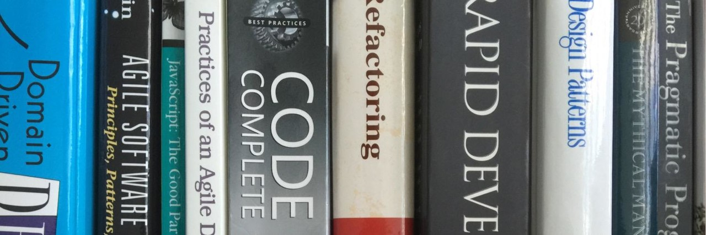
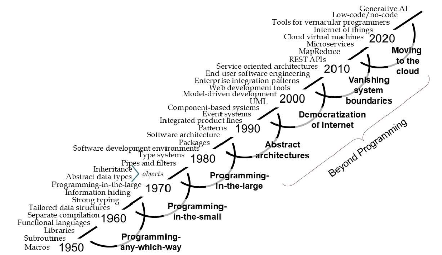

Last month there was a [Software Development Retreat](https://www.thoughtworks.com/about-us/events/the-future-of-software-development) held in Deer Valley, Utah. Similar to the [Agile Summit in Snowbird (2001)](https://agilemanifesto.org/history.html), and attended by many of the same people, the aim was to discuss ideas around the 'new inflection point: the shift to AI-native software development'.

Not long after this I was able to not only attend a debrief of the session by [Thoughtworks' James Lewis](https://www.thoughtworks.com/en-au/profiles/j/james-lewis), but also another panel session discussing the impending impact of AI on software by various local CTOs. It was interesting to me that there was a lot of overlap in these two events, and most of this was around the impact of AI specifically on coding tasks and how that may impact not only the quality of code but also hiring practices of development teams and the future of 'engineering thinking'.

In short, is AI turning code-writing into a commodity which can simply be bought? If so, what happens to the overall engineering pipeline? Is it also changed forever or will we finally be able to apply more rigour to it? What will our future time-to-market be? And as a bonus, if development time is no longer a major constraint, are concepts like Technical Debt a thing of the past?

## The Engineering Discipline

I have always been interested in Software Engineering as a discipline, and how 'correct' it is to call it 'Engineering'. This question has been living in the back of my head through the various changes and disruptions, not just external disruptions like web apps and mobile app, but internal ones like TDD, Agile and 'The Cloud'.

Through each one I have thought 'is this what will turn Software Engineering into **real** engineering'?

But wait, that must mean that I don't think that Software Engineering is real engineering now? Yes and no. There is certainly software out there that has been developed under rigorous engineering practices; consider the software that operates on spacecraft, aeroplanes and medical devices. I even worked with a Railway Signalling company which developed safety-critical software.

But even there, while there was an audit-driven onus for the team to prove that it was 'adhering to safety-level engineering practices', I still had niggles that we were not practicing real engineering. After all, you only had to stroll to another department to see other engineering teams referencing their structural guides and consulting their electronics power usage handbooks.

The software teams I worked on didn't have anything like that... just discussion and debate around code structure. Was that really the same?

## Engineering Constraints

In her 1990 paper ["Prospects for an Engineering Discipline of Software"](https://www.sei.cmu.edu/documents/1010/1990_005_001_299270.pdf), Mary Shaw presents a definition of Engineering based on commonalities between other definitions:

 > Creating cost-effective solutions...to practical problems...by applying scientific knowledge...[and] building things...in the service of mankind.

In her [2016 GOTO presentation](https://youtu.be/lLnsi522LS8?si=RtsahTA4Xu1i6cl0), Shaw elaborates the 'cost-effective' attribute into there being limits on knowledge, time and resources. We all know these limits, although we are probably more used to the 'project management triangle' which limits scope, time and resources.

With the advent of AI, what happens now to the 'resources' contstraint? The AI pundits are claiming that will almost vanish, but they also neglect to remind us that 'resources' also includes money. Assuming AI agents are orders of magnitude faster than human coders, this still comes at a cost of tokens. Experienced engineers on the internet are already saying that while they could achieve fairly complex outcomes much faster, their token consumption was much higher than for more trivial tasks.

This tends to make sense and align with regular software teams requiring more time as complexity increases (in an exponential, not linear, fashion). So resources are just shifting around.

## Emerging constraints, Emerging Abstractions

During her presentation, Shaw states an observation more clearly than I have been able to state it before:

 > Measuring lines of code is really counting how fast people type, and that hasn't got much faster over the years... When we talk about productivity, we picked how fast you can type, not how much capability you can generate per hour.

She makes a critical distinction between physical output 'production' and production of useful software. Agilist have been talking about this for a long time, but maybe not in a relatable form; agile processes are typically focussed on performance and refinement at the feature-level and generally optimise their processes to maximise this. They don't talk about the programming effort to do this. In fact, some practices (e.g. TDD without the refactoring) try to *minimise the amount of code written to achieve the functionality*.

Shaw also makes an observation about how she measures engineering progress:

 > They way I measure progress is about the increasing size of the chunk you don't look inside.

This is evident in the following diagram:

As the industry has progressed, we have tried time and again to move our level of thinking away from lines of code and toward functions, components and systems. This has mostly worked to keep up with the scale and complexity of the projects we are challenged with, but like the welders, riveters and concrete-pourers of construction projects, writing lines of code is still in the loop.

But now we have AI! This will fully automate away this layer into just another trivial abstraction!

Indeed, but if you follow the [Theory Of Constraints](https://www.goodreads.com/book/show/582174.Theory_of_Constraints), there is always another constraint waiting. In our case it is real 'Engineering'.

In [Gergely Orosz's recap of the same event](https://newsletter.pragmaticengineer.com/i/189035949/1-data-vs-hype-how-orgs-actually-win-with-ai), [Laura Tacho](https://newsletter.pragmaticengineer.com/p/measuring-the-impact-of-ai-on-software) described how, despite over 90% of developers using AI coding assistants, they were only saving around 4 hours a week. Hmm... If AI coding agents are as great as social media says they are, then why isn't this time-saving higher? This directly back's up Shaw's point of a decade ago, and points us to a quote from the Theory Of Constraints:

 > "I say an hour lost at a bottleneck is an hour out of the entire system. I say an hour saved at a non-bottleneck is worthless"

Assuming that AI has effectively removed coding as a bottleneck, it has also brutally revealed the other bottlenecks waiting in the wings.

## Old is New Again

The two discussion I attended seemed to have the same underlying theme - that old-school engineering principles will again have their time to shine in the software industry. These opinions fell into two similar camps:

 1. While people are obsessed with the low-level, the high-level cannot be overlooked. Writing code may be 100x faster, but when an efficiency this dramatic is uncovered, the constraints emerge in different parts of the overall process, which cannot be ignored. (As James Lewis put it on one slide, while time-to-demo is decreasing, time-to-market has barely shifted.)
 2. There is a huge risk in prioritising 'agent-mastery' over critical thinking an engineering skills and rigour, and we cannot detract our focus from this.

In my opinion, this overlaps with Mary Shaw's observations on the maturity of the Software Engineering discipline. This is one step up the abstraction ladder, but it cannot be done independently. AI coding agents are known to make mistakes, and the internet is littered with examples of security failings and a lack of guardrails. In terms of the DORA metrics, perhaps AI has decreased the Change Lead Time and increased the Deployment Frequency, but what is it doing to the Change Failure Rate?

This is where critical thinking and rigour step in.

A few years ago I was leading an effort to integrate an AI-based chatbot into the Instatruck on-demand truck booking system. The 'expert' performing the implementation was a bit fast and loose and would come back with awesome new capabilities, but under scrutiny it would reveal that other parts of the chat capabilities had regressed or broken entirely. As the CTO and a qualified senior engineer, I felt it was my responsibility to apply engineering rigour to this process, which we did. Not only did we define expected behaviour and show that it was functioning, we also created simple 'regression tests' to show that the whole system was operating to our expected standards.

So we **can** bring rigour and structure. This is the 'agent-mastery' vs 'engineering' argument in action.

In addition to this, we will need to bring critical thinking skills to the front and solve age-old problems such as context storage. Companies today already suffer with the task of capturing the 'How' and the 'Why' of engineering decisions, as well as still struggling to capture the 'What' in a structured way that allows both humans and machines to work with the same specifications. If all the industry's focus is put upon the speedup of producing lines of code, this shift is very likely to have side-effects which will affect this transfer of context even more.

Think of this another way: I mentioned the prospect of eliminating Technical Debt at the start of this post. Logically, Technical Debt has crept in because we have ben constrained by time and resources, and it would follow that if the speed of writing code increases, the debt we are left with must decrease, potentially to zero. Perhaps this is true, but the risk of focussing too narrowly on these gains are that our Technical Debt in the code translates into Sytems or Context Debt.

## The Opportunity

If we can harness AI in the right way, we have an amazing opportunity. Coding can be seen as a great historical drain on the industry's engineering capabilities simply due to its own intrinsic complexities: design patterns, boundary testing, memory safety, resource locking, cyclomatic complexity etc etc. Have our critical thinking skills been sucked into this black hole of learning and creating the next abstraction which promises to fix these problem, but generally tends to add a little bit more complixity itself? And if a computer can do this for us, can we now direct our critical-thinking skills to a more fruitful and progressive task: that of advancing the discipline?

I think so. I like the phrase 'distraction-free engineering'. In my opinion, as teh industry has scaled the abstraction ladder, programming has been a big distraction from 'Engineering', and historically, those who have been able to control and direct their thinking skills appropriately have performed better in their career. Those who are the best at this have also managed to advance the industry. But perhaps now we all have the chance to do this.

By all means, learn to prompt. But also learn or re-learn the engineering skills to apply the necessary rigour around that. Maybe when the AI dust settles, Software Engineering will be in a much, much better place.
