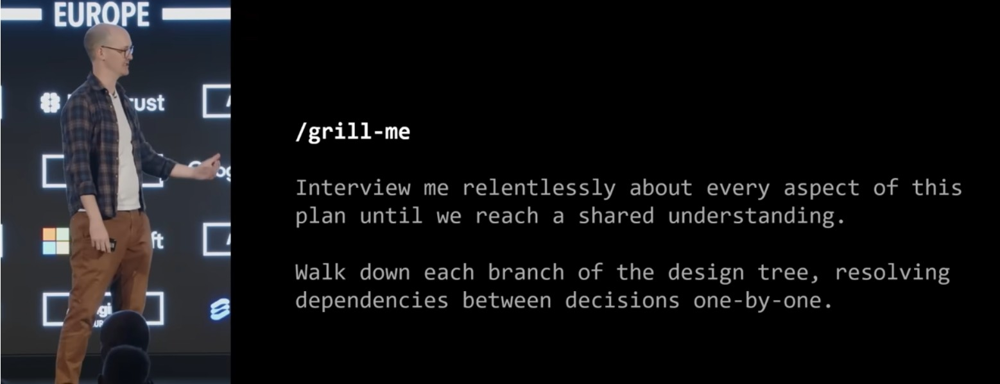

In the [previous post](./2026-05-01-specifying-behaviours-for-startups.markdown), I looked at how important it is to identify and work with the behaviours required by your product; defining these early gives the whole team a 'Ubiquitous Language', and validating against them allows you to close the loop with agreed definitions of functionality, ultimately avoiding misunderstandings and painful re-work.

With AI coding agents so prevalent, it is easy to think that these can turbo-charge your way to successful AI-driven development, but as with all tools, these must be used with caution. I've been caught in multiple traps and seen others flounder in similar ways, resulting in simply replacing the problems you are solving with new ones. Specifically I'll focus on three:

 - **Vagueness and Hallucinations**: Are you enabling hallucinations?
 - **Production vs Productivity**: Just because you have a long session doesn't make it a valuable session
 - **Speed is not quality**: Fast tools encourage us to rush forwards... and skip quality


## The Illusion of Transparency

In the previous post, I briefly mentioned how we often overestimate how much we have been understood by other people. When we have a vision in our mind, be it a new product, concept or idea, we have a specific image of it in our head, surrounded by our own personal context. When explaining it to someone else, you get a feeling that they have understood the same context, style, feeling and detail that you have built up over days or weeks, but put simply, they haven't. This is the [Illusion of Transparency](https://effectiviology.com/illusion-of-transparency/).

This illusion causes enough problems between humans, but when applied to AI, these problems multiply. I think it is a combination of marketing hype, where AI comes up with perfect answers to simply-phrased questions, and the illusion that AIs appear more intelligent than they are (this natural assumption has its own set of rabbit-holes which I won't begin to explore here!).

The additional problem presented by LLMs is their tendency to hallucinate. This comes from their other tendency to try to make us happy. An LLM's overriding goal is to *provide you with an answer*, and they have almost the entire history of humanity's recorded words with which to do so. Once we understand this, we can see that if we provide vague questions and goals, the LLM will be unable to focus on the best information, and will simply present a response containing whatever information it deems statistically most likely to be appropriate. But our problem is not the 'statistical average' (especially if it is novel).

Imagine asking your new personal assistant: "Can you book me a haircut tomorrow". They will not know your haircut preferences, your favourite location, your availability according to your diary, and that one time you had a really bad result. They will just book something that they think is most likely to be right, and will also be tainted with their own biases. The request has to be augmented with this information for it to be meaningful to you, and unlike a personal assistant, you typically have to provide this information to an LLM *all the time*.

### AI "Interrogation" prompting

A technique I have seen that works well is the "Grill Me" skill presented in the excellent [video by Matt Pocock](https://www.youtube.com/watch?v=v4F1gFy-hqg). In it he suggests that you instruct an LLM to basically interrogate you... but in a nice way:



I have tried this, and it works brilliantly. Continuing an example from [the previous post](./2026-05-01-specifying-behaviours-for-startups.markdown#lets-get-real) where we needed to define subscription behaviour, I applied this "relentless interviewing" technique with the following results:

 > 1. **What is the pricing topology?**
    - *Flat Rate*: A single fixed price per billing cycle (e.g., $15/month for everything).
    - *Tiered/Feature-Gated*: Different price points unlocking different features (e.g., Bronze, Silver, Gold).
    - *Usage-Based/Metered*: Users pay a base fee plus a variable amount based on what they actually consumed (e.g., number of API calls, storage used, seats added).
    - If Tiered or Usage-Based, what are the specific thresholds or gates?
 > 2. **How do we define "Fairly" for the business vs. the customer?**
    - If a user upgrades mid-month, do we charge them the full new price immediately, or do we prorate it (calculate the fractional difference for the remaining days) and apply it to the next invoice?
    - If they downgrade mid-month, do they get a credit on their account, a partial refund, or do they keep the higher-tier access until the end of the current billing cycle?
 > 3. **What is the cadence, and is there a "Free" element?**
    - What are the billing intervals (monthly only, annual with a discount, etc.)?
    - Is there a free trial period? If yes, do we require them to upfront their credit card details to start the trial, or do they only provide a card when the trial ends?

and so on... continuing to drill down your choices to eke out the fine details. After a barrage of these questions, it spat out the following behavioural rules:

```
1. Plan Structure & Billing Cadence
    1.1 Tiered Hierarchy: The application must support a tiered pricing structure (e.g., Free Tier, Tier 1, Tier 2, Tier 3).
    1.2 Billing Interval: The billing cycle is strictly monthly. For all proration calculations, every calendar month is treated as exactly 30 days.
    1.3 Upfront Collection: Users must provide valid credit card details at the time of signing up for the 14-day free trial.

2. Trial Lifecycle & Reminders
    2.1 Pre-Expiry Notifications: The system must automatically trigger transactional reminder emails to the user at two intervals prior to trial expiration:
      -  7 days before the trial ends.
      -  3 days before the trial ends.
    2.2 First Charge Trigger: The system must withhold the first subscription charge until Day 14 of the trial. No temporary authorization hold is required at initial sign-up.

3. Tier Migrations (Upgrades & Downgrades)
   ...
```

## Mistaking Production for Productivity

Much like efficiency does not necessarily equate to effectiveness, the next problem is mistaking production for productivity. LLMs default to being chatty and their natural-language abilities have the effect of [deceiving us into thinking they are connecting with us emotionally](./2025-10-ai-psychosis.markdown). This can easily lead to us having long 'coffee-conversations' with them where we assume that the length of output it gives is an indication of a high-quality ouctome.

This is rarely true in the business realm. Just as in real life, a long conversation may feel valuable (from an outcomes perspective), but it doesn't often deliver actual value that you can move forward with.


### Focus your Interactions

The [Example Mapping](./2026-05-01-specifying-behaviours-for-startups.markdown#the-example-mapping-meeting) mentioned in the previous article demonstrate the kind of environment that needs to be set up in order to give good outcomes:

 - particular roles are in the room: a product representative, a development representative and a QA representative
 - there are 'stages' of refinement defined: User stories, rules and examples
 - the goal is for agreement that a feature is ready to implement

We have to take the same approach with an AI. Examples of these are:

 - *Setting personas*. Tell the LLM you are chatting with that they are a product manager in a particular market, or a QA engineer focussed on a certain aspect of the product
 - *Defining the domain*. Instruct the LLM which domain it is operating in (e.g. accounting). Inform it what the typical user looks like and what the data is that they are dealing with (e.g. accounts, subscriptions and operational costs).
 - *Define an output format*. This is important. If you are designing a process flow, ask for a process flow output. If you are discovering behaviours for a tech team, define the output to be testable scenarios (e.g. [Gherkin](https://cucumber.io/docs/gherkin/reference))

Taking the second section of the previous results (Lifecycle & Reminders) as an example, instructing the LLM to output Gherkin-style scenarios resulted in this output:

```
Feature: Trial Lifecycle and Billing Triggers
  As a User
  I want my 14-day free trial managed accurately with timely notifications
  So that I am not charged unexpectedly and understand when my paid service begins

  Background:
    Given a User has signed up for a 14-day free trial on a paid tier
    And the User provided valid credit card details during registration
    And the system records the current date as the subscription anchor date

  Scenario Outline: Sending pre-expiry reminder notifications
    When <DaysElapsed> days have passed since the subscription anchor date
    Then the User receives a reminder email from "subscribe@myproduct.com"
    And the email subject should contain "<NotificationType>"

    Examples:
      | DaysElapsed | NotificationType |
      | 7           | 7-day reminder   |
      | 11          | 3-day reminder   |

  Scenario: Processing the initial subscription charge at trial completion
    When 14 days have passed since the subscription anchor date
    Then the User is charged $19
    And the charge amount must equal the standard monthly price of the selected tier
    And the User's subscription status is "Active"
```

These well-defined behavioural examples are exactly the fuel we need to drive our AI development agents forward... but not too fast.

## Speed is not the answer

Speed is seductive. Finishing things quickly is obviously going to get us to our own personal goals faster, which is highly desirable to everyone. But with speed comes carelessness and laziness.

The Vibe Coding trend of the last 2 years has shown multiple aspect of this, from demos and PoCs that are then deployed to the internet (and don't work), to real security issues being introduced due to over-reliance on AI-generated code. [One report](https://arxiv.org/pdf/2604.01052) claimed that almost half of code generated by AIs contained security risks. The [2024 DORA report](https://services.google.com/fh/files/misc/2024_final_dora_report.pdf#page=39) also showed that for a 25% increase in AI adoption, there was a 7% decrease in delivery stability.

Like an age-old battle-tested software product, the practice of developing software has itself been battle-tested over decades and has developed techniques which reduce the chances of this happening. Simply typing "Make me a website which calculates tax depreciation from quarterly reports" is not going to deliver a good result. It will probably work on your computer and in a demo, but putting the output anywhere near a public internet server is asking for trouble.


### Iterate, Iterate, Iterate

I have extolled the [virtues of iterating](./2025-10-why-we-iterate.markdown) before, and the same lessons can be applied here. It is practically guaranteed that the first solution that an AI coding agent spits out will not be exactly what you want, but beyond that, especially guided by software engineering professionals, there will be infrastructure, security, quality and reliability features that are expected of modern software products and applications. As well as tracking, marketing and performance metrics that are needed by any serious start-up.

After a few failures of my own, I now instruct AI agents to:

 - Deliver features incrementally, writing (reviewable) tests first
 - Wait for my review
 - Deploy in a 'production' environment whenever possible

These rules go all the way back to the [Agile Manifesto](https://agilemanifesto.org/), where the highest priority was placed on *working software*.


## Wrapping Up

I have been experimenting a lot with Spec-Driven Development, which is certainly a big step up from straight-up vibe-coding or working on a function-by-function level with the current AI code generation tools. However for all its benefits there are still some shortcomings; while the cost of coding may be tending to zero, the cost of misunderstanding still remains high.

The lessons I have learned overlap with the techniques above:

 - Reducing vagueness by discovering well-defined features through interrogation and focussed prompting (not much point being Spec-Driven without 'specs')
 - Tracing the delivery of these features iteratively (iterating rather than going all-in)
 - Allowing for testing and pivoting at critical points (it's hard to pivot a fully-delivered solution)

Incorporating the techniques above (refining and structuring behaviours, and then delivering incrementally) has given me much more reliable results than just relying on Spec-Driven alone. It's proof that with the increased availability of AI to augment the development of our products and reduce time-to-market, [traditional and established engineering practices](./2026-03-ai-driven-development.md) and expertise aren't obsolete; they are the enduring guardrails and skills that we need to harness this new power.