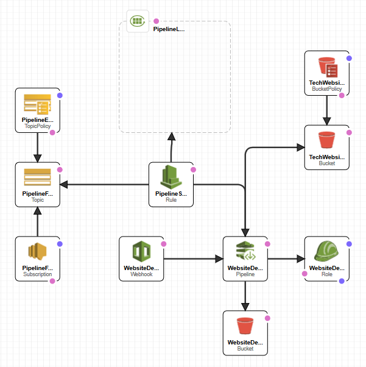

A collection of articles written by me.

## Latest

### On Disconnecting

"My email notifications recently stopped working because I changed some of the settings. Ironically the new settings were to help organise my inbox so I would be interrupted unnecessarily less often, but I didn't think they would stop altogether. I thought about googling for solutions to fix it, but the thought also occurred to me - would being interrupted even _less_ than I had planned be an even better outcome? Would fixing this actually be a step back?" [...More](articles/2022-09-22-On-Disconnecting.markdown)

### When Productivity is... Agile?

"In an effort to make productive use of my spare hours during the day, I have increased my reading over the last year. Not only of general topics (science, history) and fiction, but also self-improvement, both a mix of classic stoicism and modern self-improvement. One of my friends offered me the book ['Help' by Oliver Burkeman](https://www.goodreads.com/book/show/9411145-help), which appealed to me because I'm a sucker for books which distill a lot of information into some informative summaries.I found myself highlighting quite a few passages, and I could feel that some of them were somehow linked together in an interesting and familiar way.

I now present a list of productivity tips to you below which I feel had the most impact, and their surprising association." [...More](articles/2022-09-08-productivity-and-agile.markdown)

## About this site

In the interest of keeping things simple, and to eat a bit of my own dogfood, this site is hosted on an AWS serverless bucket and generated using CodePipeline and a static site generator [MKDocs](https://www.mkdocs.org).

An overview is presented here.

### Basic Overview

A basic overview is shown below

The website is hosted on an S3 bucket, which has a Policy attached which allows it to be viewed by the outside world.

A pipeline is defined which is kicked off by a Webhook. The Pipeline checks out the code and then runs CodeBuild (not shown on diagram), and then deploys it to the S3 bucket. The Pipeline is granted a role to be able to do this. It also has an intermediate 'deployment' bucket to operate with.

If there is a problem with the pipeline, CloudWatch has a rule to publish the failure to a SNS topic, which then pushes it out through a subscription.

### Other things

There is also a lambda which periodically checks the website health and pushes a notification to the same subscription if it detects a problem.

